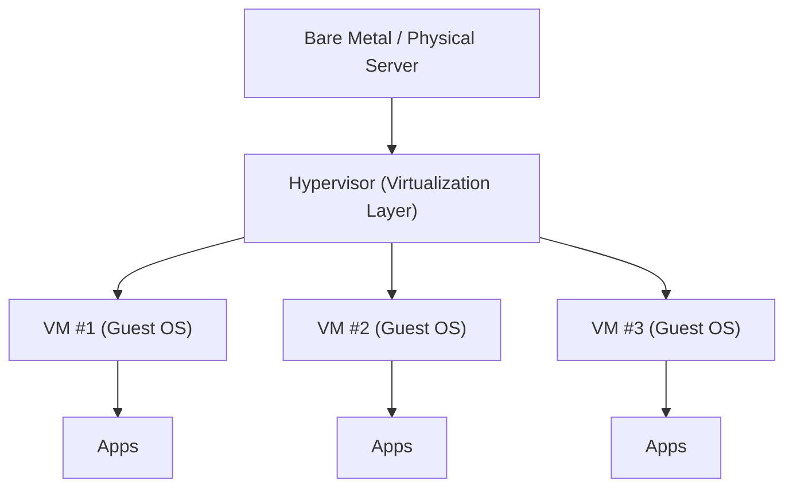

# 🧠💻 Understanding Virtualization (Gen‑Z Edition) ⚡🧩
> *One beefy server, many “fake-but-real” computers. Efficient. Clean. Iconic.* 😌✨

**Author vibe:** Senior DevOps / Ops mindset 🛠️  
**Last updated:** 2026-01-21  
**Repo-ready:** ✅ Markdown + GitHub-friendly diagrams (Mermaid)

## 🔗📚 Resources (Quick Links)
Jump straight to trusted docs (no random blogs 😤):

- ☁️ **AWS:** What is Virtualization → https://aws.amazon.com/what-is/virtualization/
- 🧠 **AWS:** Type 1 vs Type 2 Hypervisors → https://aws.amazon.com/compare/the-difference-between-type-1-and-type-2-hypervisors/
- 🏛️ **NIST:** Cloud definition (SP 800-145 PDF) → https://nvlpubs.nist.gov/nistpubs/legacy/sp/nistspecialpublication800-145.pdf
- 🪟 **Microsoft:** Hyper‑V docs → https://learn.microsoft.com/en-us/windows-server/virtualization/hyper-v/
- 🐧 **Red Hat:** KVM / virtualization guide → https://docs.redhat.com/en/documentation/red_hat_enterprise_linux/7/html/virtualization_getting_started_guide/chap-virtualization_getting_started-products
- 🧰 **Oracle:** VirtualBox docs → https://docs.oracle.com/en/virtualization/virtualbox/
- 🧱 **VMware/Broadcom:** vSphere/ESXi docs → https://techdocs.broadcom.com/us/en/vmware-cis/vsphere/vsphere/8-0.html
- 🧾 **IBM:** Hypervisors overview → https://www.ibm.com/think/topics/hypervisors

---

## 🧭 Table of Contents
- [✨ Quick TL;DR](#-quick-tldr)
- [1) What is Virtualization?](#1-what-is-virtualization)
- [2) How Virtualization Works?](#2-how-virtualization-works)
- [3) Basic Virtualization Terms](#3-basic-virtualization-terms)
- [4) Benefits of Virtualization](#4-benefits-of-virtualization)
- [5) Virtualization Technology Companies](#5-virtualization-technology-companies)
- [6) Virtualization vs Cloud](#6-virtualization-vs-cloud)
- [📚 Resources](#-resources)

---

## ✨ Quick TL;DR
**Virtualization** lets one physical server **share** its CPU/RAM/storage/network with **multiple Virtual Machines (VMs)** so you can run **multiple operating systems + apps at the same time** on the same hardware.  
Less waste 🗑️➡️✅, more value 📈, easier ops 🧑‍💻.

---

## 1) What is Virtualization?
In the “regular world” 🏠, the stack looks like this:

```text
[Physical Server] → [Operating System] → [Applications]
```

### 😵 The classic problem: underutilization
Example from the lesson:
- Physical server: **16GB RAM + 4 CPUs**
- OS uses: **4GB + 1 CPU**
- App uses: **4GB + 1 CPU**
- Remaining: **8GB + 2 CPUs** just sitting there like 🧍‍♂️🧍‍♀️ “we exist for nothing”

That’s basically **resource waste**.

### 🧠 The virtualization idea
Instead of buying more servers, we install a **virtualization layer** and run multiple OS + apps on the same physical machine:

```text
[Physical Server] → [Virtualization Layer] → [Multiple OS] → [Apps per OS]
```

> In simple terms: virtualization is “not physically real” but it behaves **as real** because it uses real hardware resources and shares them safely.

---

## 2) How Virtualization Works?
Virtualization uses a special software layer called a **Hypervisor** (aka the “magic layer” 🪄).

### 🧱 Architecture


### 🔥 What the hypervisor actually does
- Talks to hardware (CPU/RAM/Storage/Network) 🧠↔️🧱
- Splits resources into “slices” 🍕
- Gives each VM its own isolated environment 🧊
- Lets multiple OS run **simultaneously** (unlike dual-boot, which is one-at-a-time) ⏱️❌

Example from the lesson:
- VMware hypervisor: **ESX (older)** / **ESXi (newer)**

---

## 3) Basic Virtualization Terms
### 🧱 Bare Metal Server
A real physical server in a data center that you can touch 🧤 — typically meaning **no OS installed yet**.

### 🧠 Hypervisor (Host / Virtual Server)
The virtualization OS/software installed on bare metal.
- Also called: **host**, **virtual server**
- ✅ Host = Hypervisor  
- ❌ VM is NOT a host (common rookie mistake)

### 🖥️ Virtual Machine (VM)
A virtual computer running on the hypervisor.
Also called:
- **Guest OS**
- **Instance / VM instance**

### 🧑‍💼 Virtualization Manager
Manages your virtual infra (hosts, VMs, clusters, etc.)
- VMware: **vCenter**
- Oracle: **VM Manager**

### 🖥️🪟 VDI (Virtual Desktop Infrastructure)
A system to provide desktops virtually (not physical laptops/desktops). Often seen in VMware/Citrix world.

### 🔁 P2V (Physical → Virtual)
Moving a workload from physical server into a VM:
- OS + apps + configs → virtualized environment

### 🔁 V2V (Virtual → Virtual)
Migrating VMs between virtual environments/platforms.

### 🧬 VM Template
A golden image used to spin up new VMs fast:
- standard OS + standard apps + standard config ✅

### 📸 Snapshot
A point-in-time VM state to roll back if changes go sideways.
> Useful for upgrades/testing, but not a full backup replacement in many real-world setups.

### 🧫 Clone
A copy/replica of a VM.

---

## 4) Benefits of Virtualization
Here’s why Ops people love it 😌👇

- **💸 Cost savings:** fewer physical servers needed
- **🏢 Less data center real estate:** less rack space, fewer boxes
- **⚡ Lower electricity + cooling:** fewer machines = lower power draw
- **🧰 Easier management:** centralized tools + fewer physical failures
- **🛡️ Redundancy:** VMs can move to other hosts if a host dies (depending on setup)
- **🚀 Faster deployment:** templates = new VM in minutes
- **🧠 Flexible resources:** add RAM/CPU without opening the physical chassis
- **🧪 Better testing:** snapshots before patching/upgrades = easy rollback
- **📜 Licensing advantages:** sometimes better licensing models in virtual environments

---

## 5) Virtualization Technology Companies
A quick “who’s who” 👀

| Company | Hypervisor / Tech | Cloud |
|---|---|---|
| **VMware** | vSphere **ESXi** | VMware Cloud |
| **Oracle** | Oracle VM / (VirtualBox for desktop virtualization) | Oracle Cloud Infrastructure (OCI) |
| **Microsoft** | **Hyper‑V** | Azure |
| **Citrix** | **XenServer** | Citrix Cloud Services |
| **Red Hat** | **KVM** | Red Hat Cloud Suite |
| **Amazon** | (uses virtualization under the hood) | AWS |
| **Google** | (uses virtualization under the hood) | Google Cloud Platform (GCP) |

> The lesson notes VMware as a major player in enterprise virtualization (market share claims vary by source + time, so treat that as “historically strong presence”).

---

## 6) Virtualization vs Cloud
### 🧠 Virtualization (you run it)
You manage everything in your data center:
- 🧱 Hardware
- 🧠 Hypervisor
- 🖥️ Operating systems
- 📦 Apps
- 🔧 Troubleshooting, support, upgrades

### ☁️ Cloud (someone else runs it)
A provider runs the data center for you.
- Provider manages: hardware + virtualization layer (and often more)
- You focus mainly on: deploying/running your apps + uptime goals

```mermaid
flowchart LR
  subgraph OnPrem[""Virtualization (On-Prem)""]
    A1["You manage hardware"] --> A2["You manage hypervisor"] --> A3["You manage OS"] --> A4["You manage apps"]
  end

  subgraph Cloud[""Cloud""]
    B1["Provider manages hardware"] --> B2["Provider manages virtualization"] --> B3["Provider may manage OS (service-dependent)"]
    B3 --> B4["You run apps"]
  end
```

**One-liner:**  
✅ **Virtualization = technology**  
✅ **Cloud = service built using that tech (plus a lot of operational stuff)**

---

  

---

### ✅ Mini “Ops Wisdom” Note
Virtualization is awesome, but always plan for:
- capacity (CPU/RAM oversubscription) 📊
- storage performance (IOPS matters) 💽
- backups (snapshots ≠ backups) 🧯
- monitoring + patching cadence 🔔

---

🫡 **Done.** Drop this into your repo and you’re instantly “documentation main character.” 💅

---

## 📚 Resources (Full List)
Same links as above, grouped for easy browsing:

### ☁️ Cloud + Concepts
- AWS — What is Virtualization?  
  https://aws.amazon.com/what-is/virtualization/
- NIST — SP 800-145: Definition of Cloud Computing (PDF)  
  https://nvlpubs.nist.gov/nistpubs/legacy/sp/nistspecialpublication800-145.pdf

### 🧠 Hypervisors
- AWS — Type 1 vs Type 2 Hypervisors  
  https://aws.amazon.com/compare/the-difference-between-type-1-and-type-2-hypervisors/
- IBM — What are Hypervisors?  
  https://www.ibm.com/think/topics/hypervisors

### 🧰 Vendor Docs
- VMware/Broadcom TechDocs — vSphere / ESXi  
  https://techdocs.broadcom.com/us/en/vmware-cis/vsphere/vsphere/8-0.html
- Microsoft Learn — Hyper‑V  
  https://learn.microsoft.com/en-us/windows-server/virtualization/hyper-v/
- Red Hat Docs — Virtualization / KVM guide  
  https://docs.redhat.com/en/documentation/red_hat_enterprise_linux/7/html/virtualization_getting_started_guide/chap-virtualization_getting_started-products
- Oracle Docs — VirtualBox  
  https://docs.oracle.com/en/virtualization/virtualbox/
