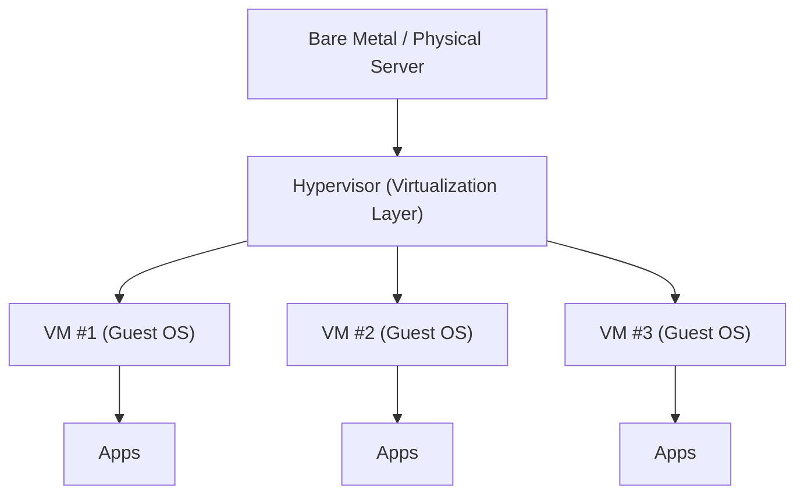
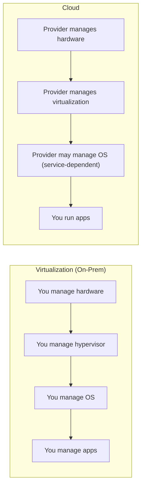

# 🧠💻 Understanding Virtualization (Gen-Z Edition) ⚡🧩
> *একটা শক্তিশালী server, অনেকগুলো “fake-but-real” computer। Efficient. Clean. Iconic.* 😌✨

**Author vibe:** Senior DevOps / Ops mindset 🛠️  
**Last updated:** 2026-01-21  
**Repo-ready:** ✅ Markdown + GitHub-friendly diagrams (Mermaid)

## 🔗📚 Resources (Quick Links)
Trusted docs-এ ডাইরেক্ট যাও (random blog না 😤):

- ☁️ **AWS:** What is Virtualization → https://aws.amazon.com/what-is/virtualization/
- 🧠 **AWS:** Type 1 vs Type 2 Hypervisors → https://aws.amazon.com/compare/the-difference-between-type-1-and-type-2-hypervisors/
- 🏛️ **NIST:** Cloud definition (SP 800-145 PDF) → https://nvlpubs.nist.gov/nistpubs/legacy/sp/nistspecialpublication800-145.pdf
- 🪟 **Microsoft:** Hyper-V docs → https://learn.microsoft.com/en-us/windows-server/virtualization/hyper-v/
- 🐧 **Red Hat:** KVM / virtualization guide → https://docs.redhat.com/en/documentation/red_hat_enterprise_linux/7/html/virtualization_getting_started_guide/chap-virtualization_getting_started-products
- 🧰 **Oracle:** VirtualBox docs → https://docs.oracle.com/en/virtualization/virtualbox/
- 🧱 **VMware/Broadcom:** vSphere/ESXi docs → https://techdocs.broadcom.com/us/en/vmware-cis/vsphere/vsphere/8-0.html
- 🧾 **IBM:** Hypervisors overview → https://www.ibm.com/think/topics/hypervisors

---

## 🧭 Table of Contents
- [✨ Quick TL;DR](#-quick-tldr)
- [1) Virtualization কী?](#1-virtualization-কী)
- [2) Virtualization কীভাবে কাজ করে?](#2-virtualization-কীভাবে-কাজ-করে)
- [3) Basic Virtualization Terms](#3-basic-virtualization-terms)
- [4) Virtualization-এর Benefits](#4-virtualization-এর-benefits)
- [5) Virtualization Technology Companies](#5-virtualization-technology-companies)
- [6) Virtualization vs Cloud](#6-virtualization-vs-cloud)
- [📚 Resources (Full List)](#-resources-full-list)

---

## ✨ Quick TL;DR
**Virtualization** একটাই physical server-এর CPU/RAM/storage/network **share** করে **multiple Virtual Machines (VMs)** বানায়—যাতে একই hardware-এ **একাধিক OS + apps একসাথে** চালানো যায়।  
কম waste 🗑️➡️✅, বেশি value 📈, Ops আরও easy 🧑‍💻।

---

## 1) Virtualization কী?
“Regular world” 🏠-এ stack সাধারণত এমন:

```text
[Physical Server] → [Operating System] → [Applications]
```

### 😵 Classic problem: underutilization
লেসন অনুযায়ী উদাহরণ:
- Physical server: **16GB RAM + 4 CPUs**
- OS ব্যবহার করে: **4GB + 1 CPU**
- App ব্যবহার করে: **4GB + 1 CPU**
- বাকি থাকে: **8GB + 2 CPUs** — একদম বসে থাকে 🧍‍♂️🧍‍♀️ “আমাদের কাজ নেই”

এটাই মূলত **resource waste**।

### 🧠 Virtualization idea
আরও server না কিনে, আমরা **virtualization layer** বসাই এবং একই physical machine-এ multiple OS + apps চালাই:

```text
[Physical Server] → [Virtualization Layer] → [Multiple OS] → [Apps per OS]
```

> সহজ ভাষায়: Virtualization “physically real না”, কিন্তু **real-এর মতোই behave করে**, কারণ এটা real hardware resources ব্যবহার করে এবং নিরাপদভাবে share করে।

---

## 2) Virtualization কীভাবে কাজ করে?
Virtualization কাজ করে একটা special software layer দিয়ে, যার নাম **Hypervisor** (aka “magic layer” 🪄)।

### 🧱 Architecture


### 🔥 Hypervisor আসলে কী করে?
- Hardware-এর সাথে কথা বলে (CPU/RAM/Storage/Network) 🧠↔️🧱
- Resources “slice” করে ভাগ করে 🍕
- প্রতিটা VM-কে isolated environment দেয় 🧊
- একাধিক OS **একসাথে** চালাতে দেয় (dual-boot এর মতো one-at-a-time না) ⏱️❌

লেসনের উদাহরণ:
- VMware hypervisor: **ESX (older)** / **ESXi (newer)**

---

## 3) Basic Virtualization Terms

### 🧱 Bare Metal Server
একটা real physical server (data center-এ থাকে, touch করা যায় 🧤) — সাধারণত বোঝায় **এখনও OS install করা নেই**।

### 🧠 Hypervisor (Host / Virtual Server)
Bare metal-এ install করা virtualization OS/software।
- এটাকে বলা হয়: **host**, **virtual server**
- ✅ Host = Hypervisor  
- ❌ VM-কে Host বলা ভুল (common rookie mistake)

### 🖥️ Virtual Machine (VM)
Hypervisor-এর উপর চলা virtual computer।  
এগুলো নামেও পরিচিত:
- **Guest OS**
- **Instance / VM instance**

### 🧑‍💼 Virtualization Manager
পুরো virtual infra manage করার central tool (hosts, VMs, clusters ইত্যাদি)।
- VMware: **vCenter**
- Oracle: **VM Manager**

### 🖥️🪟 VDI (Virtual Desktop Infrastructure)
Virtual desktop দেয় (physical laptop/desktop না)। VMware/Citrix ecosystem-এ বেশি দেখা যায়।

### 🔁 P2V (Physical → Virtual)
Physical server থেকে workload কে VM-এ নেওয়া:
- OS + apps + configs → virtualized environment

### 🔁 V2V (Virtual → Virtual)
একটা virtual environment/platform থেকে আরেকটাতে VM migrate করা।

### 🧬 VM Template
“Golden image” — দ্রুত নতুন VM spin up করার জন্য:
- standard OS + standard apps + standard config ✅

### 📸 Snapshot
VM-এর point-in-time state, যাতে change ভুল হলে rollback করা যায়।  
> Upgrades/testing-এ super useful, কিন্তু অনেক real-world case-এ full backup replacement না।

### 🧫 Clone
একটা VM-এর copy/replica।

---

## 4) Virtualization-এর Benefits
Ops লোকেরা এটা কেন পছন্দ করে 😌👇

- **💸 Cost savings:** কম physical server লাগে
- **🏢 Less data center real estate:** কম rack space, কম box
- **⚡ Lower electricity + cooling:** কম machine = কম power/cooling
- **🧰 Easier management:** centralized tools + কম physical failure
- **🛡️ Redundancy:** host down হলে VM অন্য host-এ move হতে পারে (setup-এর ওপর depend করে)
- **🚀 Faster deployment:** template দিয়ে মিনিটে VM
- **🧠 Flexible resources:** chassis খুলে RAM/CPU বসাতে হয় না
- **🧪 Better testing:** patch/upgrade আগে snapshot নিয়ে safe rollback
- **📜 Licensing advantages:** কিছু vendor virtual environment-এ ভালো licensing benefit দেয়

---

## 5) Virtualization Technology Companies
“Who’s who” 👀

| Company | Hypervisor / Tech | Cloud |
|---|---|---|
| **VMware** | vSphere **ESXi** | VMware Cloud |
| **Oracle** | Oracle VM / (VirtualBox for desktop virtualization) | Oracle Cloud Infrastructure (OCI) |
| **Microsoft** | **Hyper-V** | Azure |
| **Citrix** | **XenServer** | Citrix Cloud Services |
| **Red Hat** | **KVM** | Red Hat Cloud Suite |
| **Amazon** | (uses virtualization under the hood) | AWS |
| **Google** | (uses virtualization under the hood) | Google Cloud Platform (GCP) |

> লেসনে বলা হয়েছে VMware enterprise virtualization-এ বড় প্লেয়ার (market share সময়ের সাথে বদলায়, তাই এটাকে “historically strong presence” ধরে নাও)।

---

## 6) Virtualization vs Cloud

### 🧠 Virtualization (you run it)
তোমার data center-এ তুমি সবকিছু manage করো:
- 🧱 Hardware
- 🧠 Hypervisor
- 🖥️ Operating systems
- 📦 Apps
- 🔧 Troubleshooting, support, upgrades

### ☁️ Cloud (someone else runs it)
Provider তোমার জন্য data center চালায়।
- Provider manage করে: hardware + virtualization layer (এবং আরও অনেক কিছু)
- তুমি focus করো: apps deploy/run + uptime goals



**One-liner:**  
✅ **Virtualization = technology**  
✅ **Cloud = service built using that tech (plus a lot of operational stuff)**

---

### ✅ Mini “Ops Wisdom” Note
Virtualization দারুণ, কিন্তু plan করো:
- capacity (CPU/RAM oversubscription) 📊
- storage performance (IOPS matters) 💽
- backups (snapshots ≠ backups) 🧯
- monitoring + patching cadence 🔔

---

🫡 **Done.** Repo-তে drop করলেই তুমি documentation main character. 💅

---

## 📚 Resources (Full List)
Same links, শুধু group করে দিলাম:

### ☁️ Cloud + Concepts
- AWS — What is Virtualization?  
  https://aws.amazon.com/what-is/virtualization/
- NIST — SP 800-145: Definition of Cloud Computing (PDF)  
  https://nvlpubs.nist.gov/nistpubs/legacy/sp/nistspecialpublication800-145.pdf

### 🧠 Hypervisors
- AWS — Type 1 vs Type 2 Hypervisors  
  https://aws.amazon.com/compare/the-difference-between-type-1-and-type-2-hypervisors/
- IBM — What are Hypervisors?  
  https://www.ibm.com/think/topics/hypervisors

### 🧰 Vendor Docs
- VMware/Broadcom TechDocs — vSphere / ESXi  
  https://techdocs.broadcom.com/us/en/vmware-cis/vsphere/vsphere/8-0.html
- Microsoft Learn — Hyper-V  
  https://learn.microsoft.com/en-us/windows-server/virtualization/hyper-v/
- Red Hat Docs — Virtualization / KVM guide  
  https://docs.redhat.com/en/documentation/red_hat_enterprise_linux/7/html/virtualization_getting_started_guide/chap-virtualization_getting_started-products
- Oracle Docs — VirtualBox  
  https://docs.oracle.com/en/virtualization/virtualbox/
